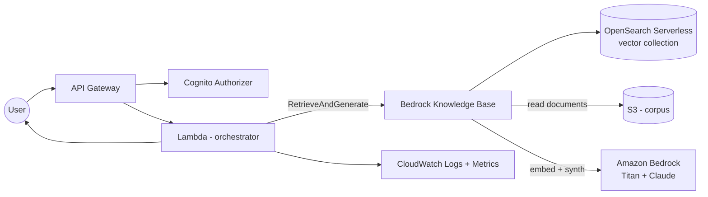

# 01 — RAG with Bedrock + OpenSearch Serverless

> Retrieval-augmented generation over a private corpus, using Amazon Bedrock Knowledge Bases and OpenSearch Serverless as the vector store.

## Problem statement

Your users need to ask natural-language questions over an internal document corpus (policies, runbooks, contracts, product docs) and get answers grounded in that corpus, with citations. You want this without standing up a vector DB cluster, without managing embeddings yourself, and with as little plumbing as possible.

## Components

- **Amazon Bedrock — Foundation Models.** Claude Sonnet for synthesis. Titan Text Embeddings for vectorising chunks. Both managed; no model hosting.
- **Amazon Bedrock — Knowledge Bases.** Owns ingestion, chunking, embedding, retrieval. Eliminates ~70% of the plumbing you'd otherwise write.
- **Amazon OpenSearch Serverless (vector collection).** Vector store with hybrid (BM25 + KNN) search. Auto-scales OCUs.
- **Amazon S3.** Source-of-truth bucket for the documents — KB watches a prefix and re-ingests on change.
- **Amazon API Gateway (REST) + AWS Lambda.** Thin orchestration layer in front of `RetrieveAndGenerate`.
- **Amazon Cognito** (optional). User authentication + per-user audit context.
- **Amazon CloudWatch.** Logs, metrics, and embedded-metric-format custom metrics for citations-per-query and latency.
- **AWS IAM.** Least-privilege roles per Lambda; KB has a dedicated role with read-only on the S3 prefix and write on the vector index.

## Diagram

## Decisions

### D1 — Bedrock Knowledge Bases instead of self-managed RAG

**Context.** Building chunking + embedding + retrieval yourself is at least two weeks of work and ~600 lines of glue code (including incremental re-indexing on S3 changes).

**Decision.** Use Bedrock Knowledge Bases. Accept the constraints (chunking strategy is fixed-size + sentence-boundary, you pick a single embedding model per KB).

**Alternatives.** LangChain + pgvector on RDS (more flexibility, more ops). LlamaIndex + Pinecone (great DX, third-party data plane).

**Consequences.** Significantly faster shipping, less code to maintain, AWS-native IAM and observability. You give up some chunking flexibility — if your docs benefit from doc-aware chunking (markdown headings, code blocks), revisit.

### D2 — OpenSearch Serverless over OpenSearch Provisioned

**Context.** Vector workload is bursty (re-ingestion during the day, sparse queries at night).

**Decision.** Use the Serverless option with a vector collection, minimum 2 OCUs (1 search + 1 indexing).

**Alternatives.** Provisioned (~30–40% cheaper at steady high load, but ops-heavy). Aurora pgvector (good for joint relational/vector queries — not our case).

**Consequences.** ~USD 350/mo floor for 2 OCUs even at zero traffic. In return, no cluster sizing or rebalancing decisions.

### D3 — `RetrieveAndGenerate` server-side instead of `Retrieve` + manual synth

**Context.** We could call `Retrieve` ourselves and then `InvokeModel` separately.

**Decision.** Use `RetrieveAndGenerate` — KB owns the retrieve → synth dance, returning citations.

**Alternatives.** Manual split gives more control over prompt templates and lets you blend results across multiple KBs.

**Consequences.** Less control but one round trip and a canonical citation shape. Revisit if you need multi-KB or custom prompt engineering.

### D4 — API Gateway REST instead of Function URL

**Context.** Single Lambda fronting the KB.

**Decision.** API Gateway REST with a Cognito authorizer and a usage plan.

**Alternatives.** Lambda Function URL (cheaper, simpler — no Cognito authorizer or per-user throttling).

**Consequences.** Slightly more cost (~USD 3.50/M requests) in exchange for auth, rate limits and a stable contract.

## Cost analysis

Assumes us-east-1 on-demand. Embedding & synthesis pricing as of 2026-Q1.

| Sizing | Queries / mo | Corpus | Re-ingestion / mo | Approx. monthly USD |
| --- | --- | --- | --- | --- |
| **S** — pilot | 10 000 | 100 MB | 1× full | ~ **$430** |
| **M** — team | 200 000 | 5 GB | 1× full + 10% incrementals | ~ **$880** |
| **L** — org | 2 000 000 | 50 GB | weekly incrementals | ~ **$3 100** |

Inputs (M sizing):

- OpenSearch Serverless: 2 OCUs × 730h × $0.24 = $350
- Bedrock Claude Sonnet: 200k queries × (1k in + 0.5k out tokens avg) = 200M in + 100M out → ~$300
- Bedrock Titan Embeddings: 5 GB × 1.5 (chunk overhead) / 3 chars/token = ~2.5M tokens → ~$2.50
- API Gateway: 200k × $3.50/M = $0.70
- Lambda: 200k × 300 ms × 512 MB = ~30k GB-s → free tier
- S3: 5 GB × $0.023 = $0.12
- CloudWatch: ~$25 logs/metrics
- Misc (Cognito, data transfer): ~$200

**Verify with the AWS Pricing Calculator before any commitment.**

## Well-Architected review

**Operational excellence.** Structured logs with request_id and `kb_invocation_id`; alarms on retrieval latency p99 and on citations-per-answer = 0 (sign of a bad query or empty corpus).

**Security.** KB role scoped to a single S3 prefix; vector collection is private (data access policies, not public). Cognito JWT validated at the edge. Bedrock content filters enabled on the model invocation profile.

**Reliability.** API Gateway + Lambda are inherently multi-AZ. OpenSearch Serverless auto-rebalances OCUs. The S3 source bucket is versioned so a bad ingestion is recoverable.

**Performance efficiency.** Cold-start budget on the Lambda is ~600 ms; mitigated by provisioned concurrency on the hot Lambda when p99 latency targets demand it.

**Cost optimization.** OCU floor dominates at low traffic — consolidate multiple KBs in a single collection if you can. Move from Claude Sonnet to Haiku for routing or summarization sub-prompts.

**Sustainability.** Serverless throughout; idle capacity is minimised.

## Trade-offs

**Use this when:**

- Corpus is mostly text (Markdown, PDF, HTML, Word, simple tables).
- Queries are natural language, retrieval is the main lever, and you want citations.
- Team is small and ops capacity is limited.

**Do NOT use this when:**

- You need joint relational + vector queries → Aurora pgvector or pgvector on RDS.
- Documents are highly structured (forms, schemas) — a structured-query layer + embeddings hybrid will outperform.
- Latency budget is < 1 s end-to-end at p99 — `RetrieveAndGenerate` typically lands at 1–3 s.
- You need cross-KB blending or custom prompt templates per tenant — use `Retrieve` + manual synth instead.

## Terraform skeleton

See [`terraform/`](terraform/). The skeleton creates the S3 bucket, the KB, the vector collection, the data access policies, and a starter Lambda. **Naming, tags, IAM boundaries and state backend are intentionally omitted.**
