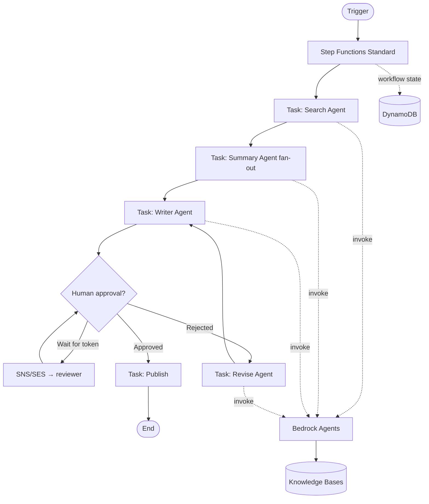

# 02 — Multi-agent orchestration with Bedrock Agents + Step Functions

> Long-running, multi-step workflows where multiple specialized agents coordinate through a durable state machine.

## Problem statement

A single LLM call is not the right shape for a workflow that takes minutes to hours, calls multiple external systems, may need human approval in the middle, and must survive a Lambda restart. You need **durable orchestration** with **specialized agents** as the workers.

Concrete example: a "research report" workflow that (1) gathers sources via a search agent, (2) summarizes each source via a summary agent, (3) drafts a report via a writer agent, (4) gates on human approval, (5) publishes.

## Components

- **AWS Step Functions Standard.** The control plane — durable, visible, supports human-approval tasks via `waitForTaskToken`.
- **Amazon Bedrock Agents.** Each step is an agent invocation. Each agent has its own action groups and prompt template.
- **AWS Lambda.** Adapters between Step Functions tasks and Bedrock agent invocations; also implements action groups.
- **Amazon DynamoDB.** Workflow state and intermediate artifacts (URLs, summaries, draft sections).
- **Amazon S3.** Final artifacts and any large intermediate payloads (Step Functions payload limit is 256 KB).
- **Amazon EventBridge.** Cross-workflow events (completion, failure, approval requested).
- **Amazon SNS / SES.** Human approval notifications.

## Diagram

## Decisions

### D1 — Step Functions Standard, not Express

**Context.** Workflow can run for minutes to hours. Express has a 5-minute hard cap.

**Decision.** Standard. Pay-per-state-transition is fine for low-volume workflows; Express savings only matter at high event rate.

**Alternatives.** Express + recursion via EventBridge — possible but adds complexity. Step Functions Standard wins for readability.

**Consequences.** $0.025/1k transitions can add up; budget early.

### D2 — One agent per *role*, not one mega-agent

**Context.** Could have a single agent with all action groups. Or split per role.

**Decision.** Split per role: Search, Summary, Writer, Reviser. Each one has a tight system prompt, only the tools it needs, and its own evals.

**Alternatives.** One generalist agent — simpler config but mixes responsibilities and harder to evaluate.

**Consequences.** More IaC, but each agent is independently testable. Easier to swap or A/B test one role.

### D3 — Human-in-the-loop via `waitForTaskToken`

**Context.** Editorial / compliance workflows need approval before publication.

**Decision.** Use Step Functions' `waitForTaskToken` pattern: emit SNS notification with token, reviewer hits a "approve" link that calls a small Lambda that calls `SendTaskSuccess` / `SendTaskFailure`.

**Alternatives.** Polling DynamoDB — wasteful. EventBridge ↔ Step Functions integration — viable but more moving parts.

**Consequences.** Tokens have a max wait of 1 year, which is plenty. Make sure the approval-Lambda authenticates the reviewer.

### D4 — Intermediate artifacts in S3 with pointers in payload

**Context.** Step Functions payload limit is 256 KB. Sources, summaries and drafts blow past that easily.

**Decision.** Put artifacts in S3 (`s3://bucket/workflow-id/...`), pass S3 keys in the payload, dereference inside each task.

**Alternatives.** Just-in-time inline via DynamoDB — DynamoDB also has 400 KB item limit. Same problem, smaller bucket.

**Consequences.** Slight extra latency per task (S3 round trip). Worth it.

## Cost analysis

| Sizing | Workflows / mo | Tasks / workflow | Approx. monthly USD |
| --- | --- | --- | --- |
| **S** — pilot | 100 | 8 | ~ **$120** |
| **M** — team | 2 000 | 12 | ~ **$1 050** |
| **L** — biz unit | 20 000 | 16 | ~ **$8 200** |

Inputs (M sizing):

- Step Functions: 2k × 12 = 24k transitions → free tier + ~$0.50
- Bedrock Claude Sonnet across all agents: ~$600
- Lambda: ~$30
- DynamoDB on-demand: ~$20
- S3 storage + requests: ~$10
- Knowledge Base retrieval: ~$200
- EventBridge / SNS: ~$5
- Logs & misc: ~$185

## Well-Architected review

**Operational excellence.** Step Functions execution history is gold for debugging — it's the equivalent of a free distributed trace. Tag every execution with `workflow_id`, `tenant`, `version` for filtering.

**Security.** Each agent's action-group Lambda has its own IAM role. The orchestrator role can `states:StartExecution` only on the specific workflow ARN. Approval Lambdas validate the reviewer identity via Cognito or signed URLs.

**Reliability.** Standard workflows survive any worker failure — Step Functions retries are first-class. Bedrock agent invocations are idempotent for the same `sessionId`.

**Performance efficiency.** Parallel summary stage uses `Map` state with `MaxConcurrency` set to a sane cap (e.g. 10) to stay under Bedrock TPS limits.

**Cost optimization.** For agents that don't need Claude Sonnet, drop to Haiku — savings stack across the workflow. Cache the search-agent results in DynamoDB with a TTL.

**Sustainability.** No idle compute — Step Functions and Lambda only run when invoked. Bedrock is multi-tenant on AWS's side.

## Trade-offs

**Use this when:**

- Workflow exceeds the 15-min Lambda cap or has human-in-the-loop gates.
- You want each step's reasoning surfaced (Step Functions UI shows inputs/outputs per state).
- Volume is hundreds to low-thousands of workflows per day.

**Do NOT use this when:**

- Workflow is short (< 30 s) and stateless — call Bedrock directly from a single Lambda.
- You need true sub-second latency on every step — Step Functions adds ~50–100 ms per state.
- The pattern is fan-out only (no orchestration) — EventBridge + SQS is simpler. See [arch 04](../04-event-driven-ai-processing/).

## Terraform skeleton

See [`terraform/`](terraform/) — creates the state machine, IAM, DynamoDB and S3. Agents are referenced by ID (you provision them separately or via the AWS console while iterating).
