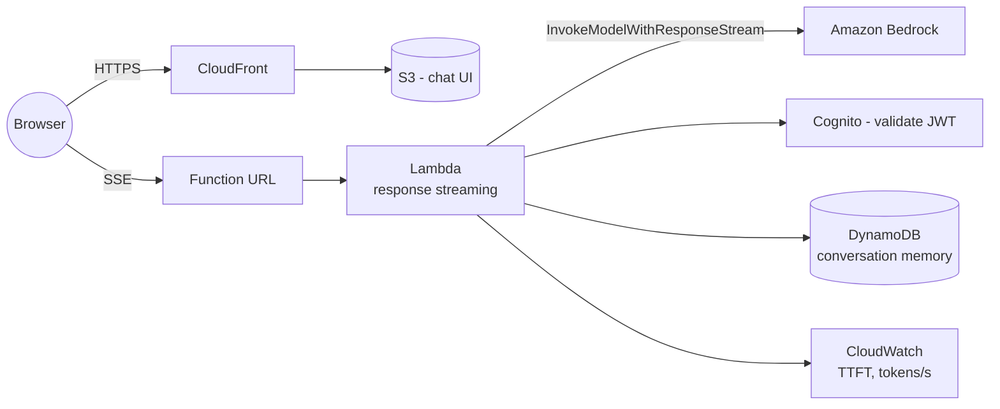

# 03 — Streaming AI inference

> Token-level streaming responses from Bedrock to a browser chat UI, with the lowest possible time-to-first-token.

## Problem statement

Users expect chat UIs to start streaming tokens within a second. A non-streaming `InvokeModel` call returns the full response in 3–8 s — too slow to *feel* responsive even when it's actually fast. We need to stream tokens end-to-end: Bedrock → backend → browser.

## Components

- **Amazon CloudFront.** TLS termination, edge caching for static assets, low-latency global delivery of the chat UI.
- **Amazon S3.** Static hosting for the chat UI.
- **AWS Lambda with response streaming.** Connects to `InvokeModelWithResponseStream`, transforms Bedrock's event stream into Server-Sent Events (SSE), and streams to the browser.
- **Function URL (with `AWS_IAM` or Cognito).** Direct HTTPS endpoint that supports streaming; API Gateway REST does **not** support response streaming (yet).
- **Amazon Bedrock — `InvokeModelWithResponseStream`.** Generates the token stream.
- **Amazon Cognito.** Authentication; ID token validated by the streaming Lambda.
- **Amazon DynamoDB.** Per-conversation memory and rate limits.
- **Amazon CloudWatch.** Custom metrics for time-to-first-token (TTFT) and tokens/s.

## Diagram

## Decisions

### D1 — Function URL with streaming, not API Gateway

**Context.** API Gateway REST does not support response streaming; HTTP API supports WebSocket but not server-sent events directly.

**Decision.** Lambda Function URL with `RESPONSE_STREAM` invoke mode. Auth via Cognito JWT validated inside the function.

**Alternatives.** API Gateway WebSocket — works but more complex client and harder caching. AppSync subscriptions — overkill.

**Consequences.** No edge throttling — implement rate limits in the Lambda (DynamoDB token bucket).

### D2 — Server-Sent Events over WebSocket

**Context.** This is a one-way server-to-client stream. The client doesn't need to push tokens back.

**Decision.** SSE. Simple `text/event-stream`; browsers reconnect automatically; one open HTTP connection per session.

**Alternatives.** WebSocket — bidirectional capability we don't need, more state.

**Consequences.** SSE has fewer edge-case bugs and is trivial to test with `curl`.

### D3 — CloudFront → S3 for the UI, Function URL **separately** (not behind CloudFront)

**Context.** Could front Function URL with CloudFront to get one domain. CloudFront has caveats with streaming responses.

**Decision.** Two endpoints: the UI on CloudFront, the API on the raw Function URL. CORS configured.

**Alternatives.** CloudFront + Lambda Function URL origin — supported but adds a tier and burns a CF distribution.

**Consequences.** Two DNS records and explicit CORS handling. Worth it.

### D4 — Conversation memory in DynamoDB, not in the request body

**Context.** Clients could send the whole history every turn. Server could remember.

**Decision.** Server-side memory in DynamoDB. Client sends only the new message and a `conversation_id`.

**Alternatives.** Client-stored history — leaks the whole conversation across CORS/refreshes; bandwidth grows linearly.

**Consequences.** Need a TTL on the table; need a "clear" endpoint.

## Cost analysis

| Sizing | Conversations / mo | Avg tokens / turn | Approx. monthly USD |
| --- | --- | --- | --- |
| **S** — demo | 1 000 | 800 | ~ **$25** |
| **M** — product | 50 000 | 1 500 | ~ **$640** |
| **L** — scale | 1 000 000 | 1 800 | ~ **$15 200** |

Inputs (M sizing):

- Bedrock Claude Sonnet: 50k × 1.5k = 75M tokens (~70% input, 30% output) → ~$500
- Lambda streaming: 50k × 3 s × 512 MB = ~75k GB-s → ~$1.25
- Function URL: free
- DynamoDB on-demand: ~$15
- CloudFront + S3: ~$10
- Cognito: 50k MAU → first 50k free, then $0.0055/user → varies
- CloudWatch logs + metrics: ~$15
- Misc: ~$100

## Well-Architected review

**Operational excellence.** Custom CloudWatch EMF metrics for `ttft_ms`, `tokens_per_second`, `output_tokens`. Alarm on p99 TTFT > 1500 ms.

**Security.** JWT validation in the Lambda; tight CORS; rate limits per Cognito sub. Bedrock model invocation profile with content filters.

**Reliability.** Function URLs are regional and multi-AZ. Bedrock throttling propagates upstream — Lambda must surface 429 cleanly so the client can back off.

**Performance efficiency.** Provisioned concurrency on the streaming Lambda for hot paths. Region-pin the deployment to where Bedrock latency is lowest for your users.

**Cost optimization.** Drop to Claude Haiku for short replies. Cache the system prompt via Bedrock prompt caching (75% discount on cached input tokens).

**Sustainability.** Serverless throughout; streaming reduces wasted retransmission of unused tokens (clients can abort mid-stream).

## Trade-offs

**Use this when:**

- The UI is chat or chat-like and TTFT matters.
- Volume is bursty (Function URL scales linearly with no cold-start tax beyond Lambda's normal cold start).

**Do NOT use this when:**

- You need server-side fan-out to multiple clients per conversation — SSE is point-to-point.
- You need true bidirectional control (e.g. voice with interruption) — WebSocket + API Gateway WS is the pattern.
- The response is structured JSON the client must validate atomically — streaming JSON is hard to handle on the browser.

## Terraform skeleton

See [`terraform/`](terraform/) — Lambda with `RESPONSE_STREAM` invoke mode, Function URL with `AWS_IAM`, CloudFront + S3 for the UI.
