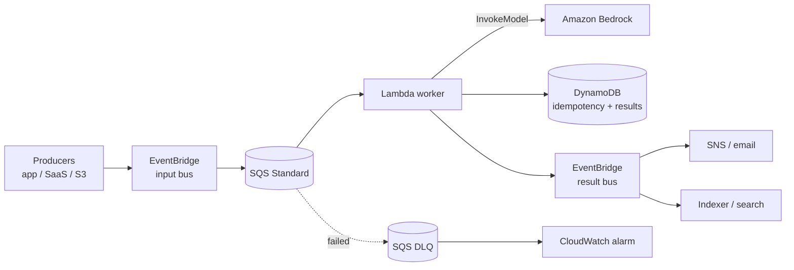

# 04 — Event-driven AI processing

> Async classification, enrichment or moderation of incoming items at scale, with retries, DLQ and back-pressure.

## Problem statement

A stream of items (uploaded documents, customer messages, transactions) needs to be processed by a model — classify, summarize, extract entities, moderate. Latency requirement is "minutes", not seconds. Volume is bursty: 10x spikes during business hours.

You want **at-least-once** processing, automatic retries, a dead-letter destination for poison pills, and a clean way to fan out to multiple downstream consumers of the result.

## Components

- **Amazon EventBridge.** Schema-aware bus that accepts events from multiple producers (apps, SaaS, S3 notifications). Rule-based routing.
- **Amazon SQS Standard.** Decoupling queue between EventBridge and the worker — gives us back-pressure and a DLQ.
- **AWS Lambda — worker.** Pulls from SQS, calls Bedrock, writes results.
- **Amazon Bedrock — `InvokeModel`.** The actual AI work.
- **Amazon DynamoDB.** Idempotency table (dedup keys) and results store.
- **Amazon SQS — DLQ.** For messages that fail after max receive count.
- **Amazon EventBridge — result bus.** Emits a `ProcessingCompleted` event downstream consumers subscribe to (notifications, indexing, etc.).
- **Amazon CloudWatch.** Queue-depth alarms, Bedrock throttle metric, worker error rate.

## Diagram

## Decisions

### D1 — SQS between EventBridge and the worker, not direct EventBridge → Lambda

**Context.** EventBridge → Lambda is supported, but the failure semantics are weak: a failing Lambda gets the event once, then EventBridge sends it to the rule's target DLQ if configured.

**Decision.** EventBridge → SQS → Lambda. SQS provides visibility timeout, max receives, configurable retry, and a DLQ that we own.

**Alternatives.** EventBridge Pipes (newer) — also good, more sources. Worth revisiting once your producers grow.

**Consequences.** One extra hop (~10 ms). Tiny price for first-class retry semantics.

### D2 — Idempotency keys in DynamoDB, not "best effort"

**Context.** SQS is at-least-once. Bedrock calls are expensive and have side effects (write to results store).

**Decision.** Compute a deterministic `idempotency_key` from the event payload, conditional-PutItem into DynamoDB before invoking Bedrock. If the put fails (key exists), skip.

**Alternatives.** Rely on the worker being deterministic — fragile, breaks the moment you add a side effect.

**Consequences.** One extra DynamoDB call per event. Saves money and prevents duplicate downstream events.

### D3 — Result bus separate from input bus

**Context.** Downstream consumers want to react to *completed* processing — but should not see the raw inputs.

**Decision.** Emit `ProcessingCompleted` events on a second EventBridge bus. Schema includes only the result + a reference to the original event.

**Alternatives.** Reuse the input bus and tag events. Couples producers to consumers; harder to govern.

**Consequences.** Two buses to monitor. Worth it for governance.

### D4 — Reserved concurrency on the worker

**Context.** Without a cap, a backlog spike triggers thousands of concurrent Bedrock calls — instant throttling.

**Decision.** Reserved concurrency on the worker matched to your Bedrock TPS quota (e.g. 20).

**Alternatives.** Provisioned concurrency — costs idle capacity. Reserved is free.

**Consequences.** Under a spike, the SQS queue grows but Bedrock stays healthy. Backlog drains gracefully.

## Cost analysis

| Sizing | Events / mo | Avg tokens / event | Approx. monthly USD |
| --- | --- | --- | --- |
| **S** — pilot | 50 000 | 800 | ~ **$80** |
| **M** — product | 1 000 000 | 1 200 | ~ **$1 100** |
| **L** — high volume | 25 000 000 | 1 500 | ~ **$28 000** |

Inputs (M sizing):

- EventBridge: 1M events × $1/M × 2 buses = ~$2
- SQS: 1M × 2 (send + receive) = 2M requests, > free tier → ~$0.40
- Lambda: 1M × 1.5 s × 512 MB = ~750k GB-s → ~$12
- Bedrock Claude Haiku: 1M × 1.2k tokens = 1.2B tokens (60/40 in/out) → ~$900
- DynamoDB on-demand: 1M reads + 2M writes + storage → ~$50
- CloudWatch: ~$50
- Misc: ~$85

Note the use of **Haiku** at M scale — switch to Sonnet for higher quality at ~3x cost.

## Well-Architected review

**Operational excellence.** ApproximateAgeOfOldestMessage alarm on the queue (catches stuck consumers). DLQ alarm with a `messages-in > 0` threshold and a 5-minute paging gap.

**Security.** Worker has minimal IAM — `sqs:Receive*` on one queue, `bedrock:InvokeModel` on a specific model ARN. Result bus events do not include the raw input — only a reference.

**Reliability.** SQS visibility timeout > p99 worker duration × 6 (handles retries). DLQ is the safety net. Idempotency table prevents double-side-effects.

**Performance efficiency.** Batch size on the SQS trigger: 5–10 messages per invocation amortizes Lambda init. Bedrock calls inside the worker can run in parallel via asyncio.

**Cost optimization.** Drop to Haiku unless quality demands Sonnet. Compress / dedup events at the producer side. Set short TTL on the idempotency table (24 h is plenty).

**Sustainability.** No idle compute; queue-driven scaling minimises waste.

## Trade-offs

**Use this when:**

- Latency is minutes-tolerant.
- You need durable retries and a DLQ.
- Multiple downstream consumers want to react to completion.

**Do NOT use this when:**

- The user is waiting on the result interactively — go synchronous, see [arch 03](../03-streaming-ai-inference/).
- Strict ordering is required — SQS Standard does not preserve order. Switch to SQS FIFO (lower throughput) or Kinesis.
- The processing is sub-100 ms — the queueing overhead dominates.

## Terraform skeleton

See [`terraform/`](terraform/) — input/output buses, SQS + DLQ, worker Lambda with reserved concurrency, IAM roles, DynamoDB tables.
