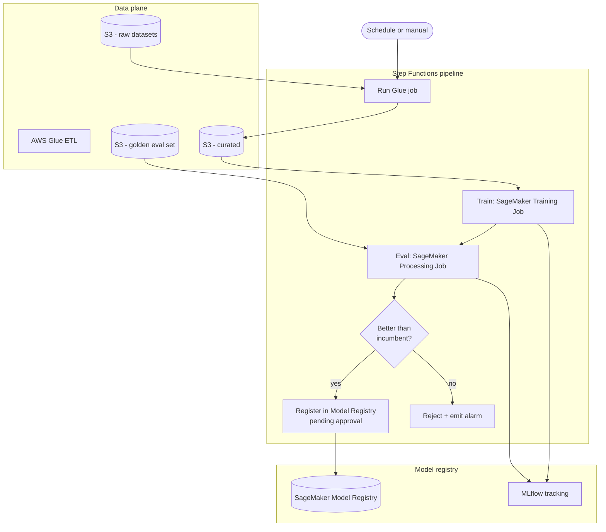

# 05 — Fine-tuning pipeline

> Repeatable pipeline to fine-tune custom models on top of foundation models, with versioned datasets, deterministic training jobs, evaluations and one-click rollback.

## Problem statement

Off-the-shelf foundation models are great until they aren't — specific tone, jargon, or output formats often need fine-tuning. You need a pipeline that (1) tracks datasets and their versions, (2) runs deterministic training jobs, (3) evaluates against a golden set, (4) registers new models, (5) promotes them through environments only when evals beat the incumbent.

This is mostly *MLOps*, not "AI" — the LLM is one component in a CI/CD pipeline for models.

## Components

- **Amazon S3.** Raw and processed datasets; model artifacts; eval reports. The single source of truth.
- **AWS Glue.** ETL for raw → processed dataset transformations (deduping, formatting to the model's expected schema).
- **Amazon SageMaker Training Jobs.** Where fine-tuning runs. Either custom containers or SageMaker JumpStart for popular base models.
- **Amazon SageMaker Model Registry.** Tracks model versions with approval gates between staging and production.
- **MLflow on Amazon SageMaker.** Experiment tracking — metrics, parameters, artifacts per training run.
- **AWS Step Functions.** Orchestrates: ingest → ETL → train → evaluate → register → (optional) deploy.
- **Amazon EventBridge Scheduler.** Cron triggers for periodic re-training.
- **Amazon SageMaker Endpoints** (real-time) or **Batch Transform** (offline) — depending on inference pattern.
- **Amazon CloudWatch.** Job-level metrics + custom eval metrics.

## Diagram

## Decisions

### D1 — SageMaker, not Bedrock fine-tuning

**Context.** Bedrock supports fine-tuning a small set of models. SageMaker supports anything you can put in a container.

**Decision.** SageMaker by default. Bedrock fine-tuning is a candidate when (a) the base model is supported, (b) you do not need custom training code, and (c) you want managed deployment.

**Alternatives.** Bedrock fine-tuning — simpler when applicable. Always-on hosting endpoints — costlier.

**Consequences.** More flexibility, more responsibility for instance types and training scripts.

### D2 — Model registry approval gate, not auto-deploy

**Context.** "Beat the incumbent on the golden set" is a *necessary* condition, not sufficient. Edge cases, user-facing regressions, governance.

**Decision.** Eval result is gated by SageMaker Model Registry's `Approved` status, which requires a human.

**Alternatives.** Full CD with auto-deploy on metric improvement — fine for low-risk usages, dangerous for user-facing models.

**Consequences.** Adds latency between training and production. The right trade-off when production matters.

### D3 — Golden eval set is versioned and immutable

**Context.** If the eval set drifts, you cannot compare model versions trained months apart.

**Decision.** Golden eval set lives in S3 with `Object Lock` (compliance mode). Updates create a new version with an explicit name; old versions stay.

**Alternatives.** Mutable golden set + Git versioning — fine for small text sets, ugly for binary data.

**Consequences.** Slight storage cost. Trustworthy comparisons.

### D4 — Step Functions, not SageMaker Pipelines

**Context.** SageMaker Pipelines is purpose-built for ML. Step Functions is general-purpose.

**Decision.** Step Functions. Reason: Step Functions is more flexible (we have non-ML steps — emit EventBridge, push to a Slack webhook, gate on a human approval), and the team already uses it for other workflows.

**Alternatives.** SageMaker Pipelines — better integrated with the Studio UI, but a second orchestrator to learn and maintain.

**Consequences.** Less SageMaker-UI integration. Lower cognitive load.

## Cost analysis

The pipeline itself is cheap; **training jobs dominate**. Costs are highly model-dependent.

| Sizing | Re-training frequency | Approx. monthly USD (pipeline + training) |
| --- | --- | --- |
| **S** — prototype | monthly, ml.g5.xlarge, 8h | ~ **$120** |
| **M** — production | weekly, ml.g5.12xlarge, 12h | ~ **$2 800** |
| **L** — multi-model | daily, ml.g5.48xlarge, 6h, 3 models | ~ **$22 000** |

Inputs (M sizing):

- SageMaker Training: 4 runs × 12h × ml.g5.12xlarge @ ~$7/hr = ~$340; with spot capacity reductions (50%) → ~$170
- SageMaker Processing (eval): 4 × 1h × ml.g5.xlarge → ~$5
- Glue: 4 × 30 min DPU = ~$20
- S3: 200 GB datasets + model artifacts → ~$5
- Step Functions transitions: trivial
- MLflow on SageMaker: small instance ~$50
- Endpoint hosting (if real-time): 1 × ml.g5.xlarge × 730h = ~$2 200

If the endpoint is **on-demand** (Serverless Inference) instead of always-on, costs drop dramatically for low-traffic models.

## Well-Architected review

**Operational excellence.** Training jobs are tagged with `dataset_version`, `base_model`, `git_sha`. The Model Registry version is linked to those tags so anyone can reproduce a model.

**Security.** Training role has read-only on the dataset bucket and write-only on the model artifact bucket — separate buckets. KMS encryption everywhere. SageMaker network isolation enabled (no internet access for training jobs).

**Reliability.** Step Functions retries the training task with exponential backoff. Failures emit to EventBridge with payload — a separate Slack consumer pages the ML team.

**Performance efficiency.** Spot capacity for training: 50–70% savings when checkpointing is enabled. Right-size instance types — bigger isn't always faster for fine-tuning.

**Cost optimization.** Cold-start your endpoints with SageMaker Serverless Inference if traffic is intermittent. Auto-tag everything for cost allocation.

**Sustainability.** Train on the smallest model that meets the eval bar. Re-train only when data drift triggers it (compute drift score as part of ETL).

## Trade-offs

**Use this when:**

- Off-the-shelf prompting + RAG doesn't get you to the quality bar.
- You have at least a few hundred high-quality training examples and a meaningful eval set.
- Output format / domain language matter enough to justify ongoing pipeline ownership.

**Do NOT use this when:**

- You haven't seriously tried prompt engineering + few-shot + RAG first. Fine-tuning is the *last* lever, not the first.
- Your training data is < 100 examples — adapt prompts, not weights.
- You only have a one-off need — a few thousand dollars in Bedrock calls beats a permanent pipeline.

## Terraform skeleton

See [`terraform/`](terraform/) — buckets with Object Lock for the golden set, IAM roles, Step Functions skeleton. Training scripts live in your own ML repo and are referenced by S3 URI.
