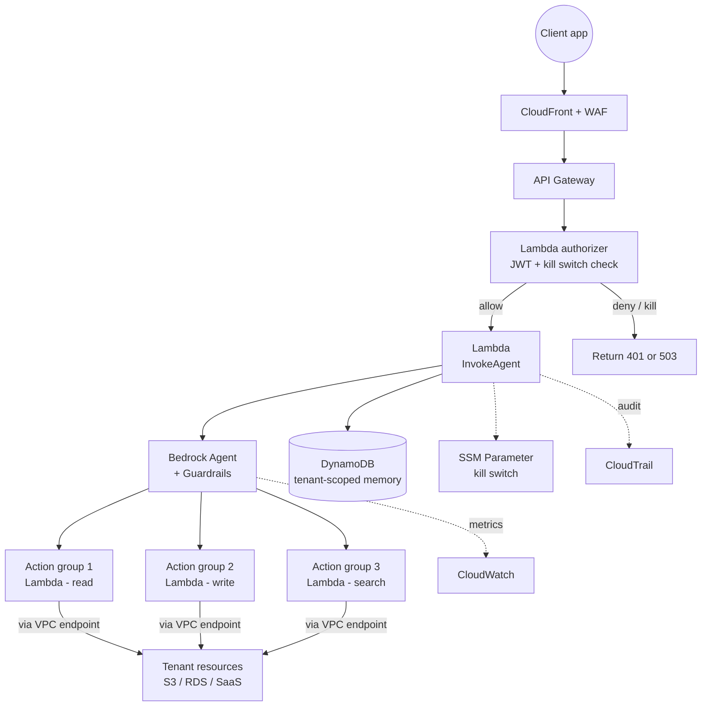

# 06 — Secure agentic system with Bedrock Agents + Guardrails

> A multi-tenant production agent with hard guardrails, network isolation, per-tenant IAM, audit logging, and a "kill switch" you can hit when something goes wrong at 3 AM.

## Problem statement

You are putting an agent in front of a real product, with real users, holding real data. Naive agent designs leak across tenants, drift into off-topic conversations, expose tools to abuse, and have no way to halt a runaway invocation. You need an architecture that takes the agent itself as **untrusted code running on your behalf** and contains its blast radius accordingly.

## Components

- **Amazon Bedrock — Agents.** Reasoning loop, tool selection, conversation memory.
- **Amazon Bedrock — Guardrails.** Content filters (denied topics, PII redaction, profanity, harmful content). Applied **on every model invocation** in the agent loop.
- **AWS Lambda — action group implementations.** Each tool lives in a separate Lambda with its own IAM role.
- **Amazon VPC + VPC Endpoints.** All action-group Lambdas run in private subnets; Bedrock VPC endpoint keeps traffic on AWS's backbone.
- **AWS Secrets Manager.** Per-tenant credentials, fetched at invocation time. Never embedded in prompts.
- **Amazon DynamoDB.** Tenant-scoped conversation memory and rate limits (per-tenant token bucket).
- **AWS WAF (on the front door).** Edge-level rate limiting and request inspection before requests reach the agent.
- **AWS CloudTrail + Amazon CloudWatch.** Audit trail of every `InvokeAgent` call + custom EMF metrics for redaction events and guardrail blocks.
- **A "kill switch"** — a SSM Parameter that the agent's authorizing Lambda reads on every request. Flipping it returns 503 immediately, no Bedrock call.

## Diagram

## Decisions

### D1 — One agent, multiple tenants, **tenant scope injected at invocation**

**Context.** Either one agent per tenant (clean isolation, ops nightmare) or one agent for all (sharing model, but tenant scope must be enforced).

**Decision.** One shared agent. Tenant scope is injected as a `sessionAttributes` field on every `InvokeAgent` call. Every action-group Lambda **reads `sessionAttributes.tenant_id` and ignores any tenant identifier the model might have hallucinated into its arguments**.

**Alternatives.** One agent per tenant — works for small tenant counts, doesn't scale.

**Consequences.** The action-group Lambdas are the security boundary, not the agent. They must always cross-check the trusted `tenant_id` against any reference the model passes.

### D2 — Bedrock Guardrails on every invocation, not "best effort"

**Context.** Guardrails are optional per-invocation. Easy to forget on a code path.

**Decision.** The agent has a **guardrail identifier** baked into its configuration, enforced server-side by Bedrock. The orchestrator Lambda does not have permission to invoke Bedrock without the guardrail attached.

**Alternatives.** Wrap calls in your own filter — fragile, redundant with Bedrock's native filter.

**Consequences.** Guardrails contribute small latency (~50–100 ms). Worth it.

### D3 — VPC isolation for action groups; Bedrock via VPC endpoint

**Context.** Action-group Lambdas talk to tenant data — they need network-level isolation.

**Decision.** All action-group Lambdas live in private subnets with no internet route. Bedrock is reachable via the `bedrock-agent-runtime` VPC endpoint.

**Alternatives.** Public Lambdas with strict egress allowlists — possible, more brittle.

**Consequences.** VPC endpoints have a small hourly cost. Negligible vs. blast radius reduction.

### D4 — Kill switch in SSM Parameter Store

**Context.** When something is going wrong (e.g. a tool is incidentally helping abuse), you want to stop the bleeding *now*, without a deploy.

**Decision.** A `String` SSM Parameter `${project}/agent/enabled` checked by the authorizer Lambda on every request. SSM parameter changes propagate in seconds. Audit changes via CloudTrail.

**Alternatives.** Feature flag in DynamoDB — works but adds a per-request read. SSM is purpose-fit and cached.

**Consequences.** One more thing to monitor; one more thing to alarm on.

### D5 — Per-tenant rate limit, enforced *before* the agent invocation

**Context.** Without a limit, one tenant can torch your Bedrock quota for everyone.

**Decision.** Token bucket per `tenant_id` in DynamoDB, checked in the authorizer Lambda. Returns 429 with `Retry-After` if over budget.

**Alternatives.** WAF rate limit at the edge — coarser, can't distinguish tenants.

**Consequences.** One extra DynamoDB call per request. Buys fairness across tenants.

## Cost analysis

| Sizing | Tenants | Invocations / mo / tenant | Approx. monthly USD |
| --- | --- | --- | --- |
| **S** — alpha | 5 | 1 000 | ~ **$150** |
| **M** — beta | 50 | 5 000 | ~ **$2 100** |
| **L** — GA | 500 | 10 000 | ~ **$32 000** |

Inputs (M sizing):

- Bedrock Claude Sonnet × 250k invocations × 2k tokens average (heavy reasoning) → ~$1 500
- Guardrail cost: ~$0.10 / 1k requests → ~$25
- Action-group Lambdas: ~$50
- API Gateway: ~$10
- VPC endpoints: 2 endpoints × $7.20/mo + data → ~$25
- DynamoDB on-demand: ~$30
- WAF: ~$25
- Secrets Manager: 50 secrets × $0.40 → $20
- Misc (CloudTrail, CW, etc.): ~$415

## Well-Architected review

**Operational excellence.** Every action-group Lambda emits a structured log with `tenant_id`, `agent_session_id`, `tool_name`, `decision`. The kill switch ARN is monitored; flipping it triggers a Slack message.

**Security.** The **biggest pillar here**. Three layers:

1. **Edge** — WAF, JWT auth, kill switch.
2. **Authorization** — per-tenant rate limit, kill switch re-check.
3. **Tools** — each action-group Lambda re-derives `tenant_id` from the *trusted* `sessionAttributes`, never from the model's tool arguments. IAM policies on action-group Lambdas use `${aws:PrincipalTag/tenant_id}` to scope resource access.

**Reliability.** Bedrock is multi-AZ. Action-group Lambdas use reserved concurrency to avoid noisy-neighbor exhaustion of the regional Bedrock quota.

**Performance efficiency.** Prompt caching at the model layer for the agent's system prompt — large stable prefix; >75% input token discount.

**Cost optimization.** Use Haiku for the "router" sub-agent that decides which action group to call, Sonnet only for synthesis. Cache tool outputs in DynamoDB for read-heavy workflows.

**Sustainability.** Serverless throughout; no idle capacity.

## Trade-offs

**Use this when:**

- The agent is a real product touching real customer data.
- You need to demonstrate to security review that the blast radius is small.
- Multi-tenant from day one.

**Do NOT use this when:**

- Internal-only prototype with a handful of users — the security ceremony costs more than it saves.
- Single-tenant SaaS — drop the multi-tenant authz checks for simplicity.
- The agent is replaceable by a single Bedrock call — no agent loop needed.

## Terraform skeleton

See [`terraform/`](terraform/) — VPC + endpoints, agent role + guardrail, authorizer + invoke Lambdas, kill switch parameter, DynamoDB tables. Action group Lambdas are referenced by ARN — bring your own implementations.
